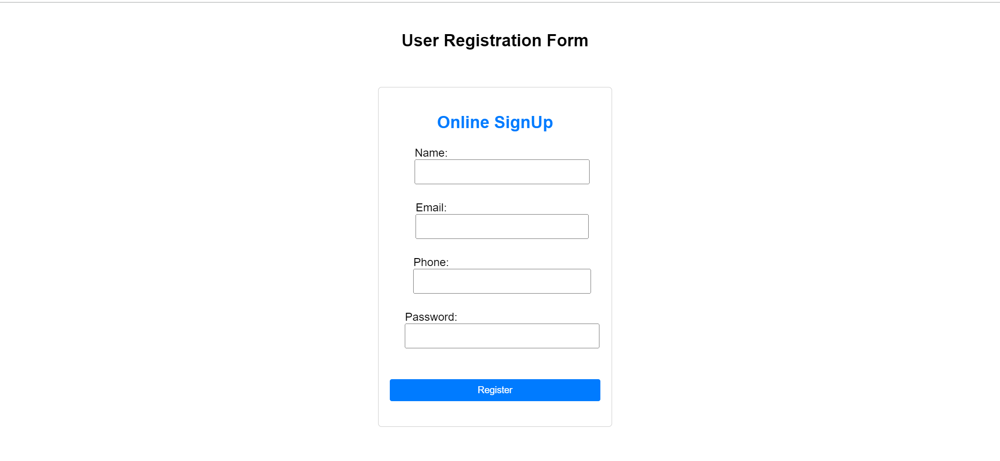
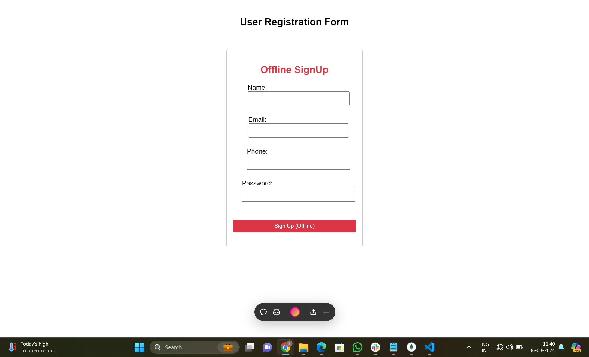

# User Registration Application

## Description
This project is a user registration application built using Node.js, Express, MongoDB, and React. It allows users to register either online or offline. Offline registration data is synchronized with the server when the user comes back online.

## Features
- User registration both online and offline.
- Synchronization of offline registration data with the server when the user comes online.
- Password encryption using bcrypt.

## Setup
1. Clone the repository.
2. Navigate to the project directory.
3. Install dependencies using `npm install`.
4. Create a `.env` file in the root directory and provide the     following environment variables:

5. Start the server using `npm start`.
6. Access the application in your browser at `http://localhost:5590`.

## Backend Setup
- The backend is built using Node.js and Express.
- MongoDB is used as the database.
- CORS  allowing browser should permit loading resources
- Install the required dependencies using `npm install`.
- Run the server using `npm start`.

## Frontend Setup
- The frontend is built using React.
- Navigate to the `client` directory.
- Install the required dependencies using `npm install`.
- Start the development server using `npm start`.

## Backend API Endpoints
- **POST /register**: Register a new user.
- **POST /syncOfflineData**: Synchronize offline registration data with the server.

## Technologies Used
- Node.js
- Express.js
- MongoDB
- React
- Bcrypt
- Axios
- Cors

## Usage
1. Access the application in your browser.
2. Fill out the registration form with the required details.
3. Click the "Register" button to register online.
4. If offline, the registration data will be saved locally.
## Screenshots

5. When online again, the saved offline data will be synchronized with the server automatically.

## Screenshots

## Deployed link
[link](https://zerkofrontend-ltjdnht5q-srinivasgokarla.vercel.app/)

## Demo link
[link](https://drive.google.com/file/d/1IPccz1aYUQ0DhHLZJZJbfSgElyASy148/view?usp=sharing)

#### Cloud Deployment

- Render
used Render for deploying the MongoDB (database), node js (Backend).
- vercel 
used vercel for deploying reactjs(frontend)

